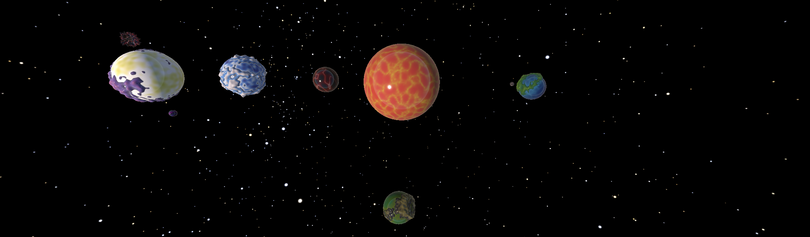
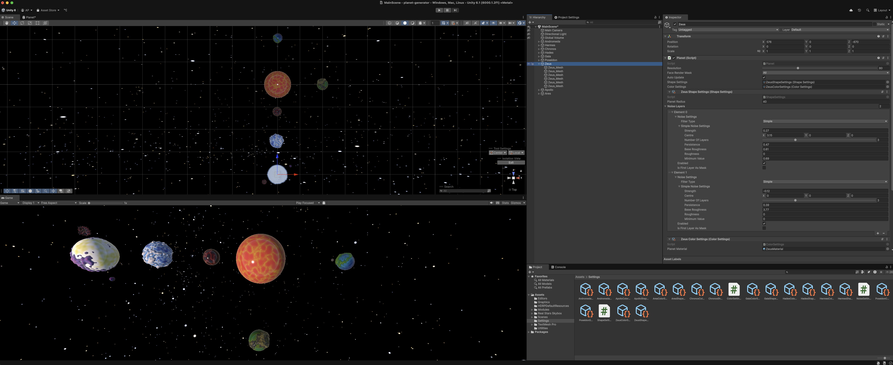

# Planet Generator

A planet generator project written with Unity in C#.

The project is developing scripts that can be reused to create unity procedural planets.

In this projects there are planets in included in my "Greek" solar system. We have:

- Chronos (Center of solar system)
- Hades (A dark and host planets like hell it self...If you know what I mean hahaha)
- Gaia (A planet filled forests. The climate are usually humid and the waters are acidic)
- Poseidon (A planet besides hades that is filled with waters and ice terrains)
- Zeus (Planet filled with lightning and crystals)
- Ares (Crystal planets, acts as the first satellite of Zeus)
- Apollo (Gem planets, acts as the second satellite of Zeus)
- Andromeda (The most fertile planets, and its ideal for human colonization, behave like our earth)

`Note: More planets coming up :)`

## Simulation Snippet

Here is is the example of the current solar systems within this repository's universe

The following image below, shows the current state of the Unity project

### Unity dependencies

- Real Stars Skybox
- Universal Render Pipeline (URP)
